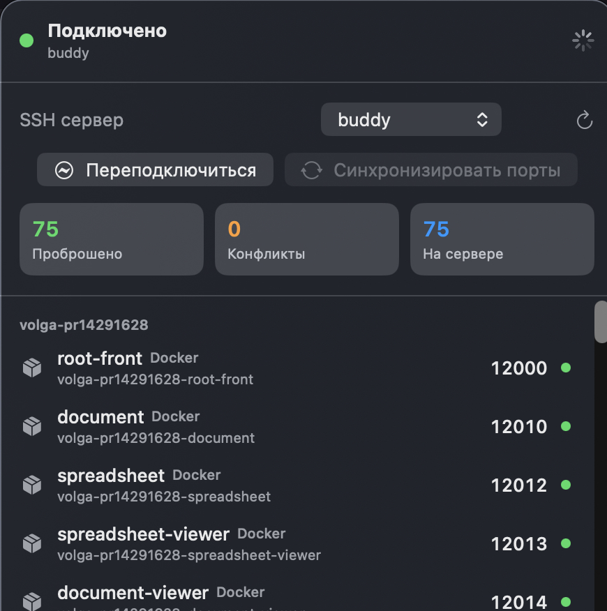
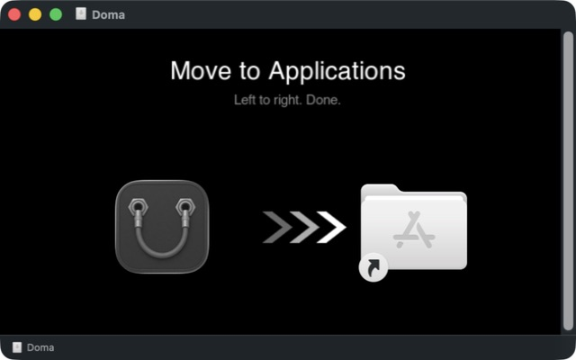

<div align="center">
  
  <h1>Doma</h1>
  <p><strong>Your remote services, right at home.</strong></p>
  <p>
    Doma mirrors TCP services from an SSH host to the same ports on
    <code>127.0.0.1</code> — automatically, as they appear.
  </p>
  <p>
    <a href="https://github.com/MrFlashAccount/Doma/releases/latest">
      
    </a>
    
  </p>
</div>

<p align="center">
  
</p>

## The same port, locally

Start Docker, Vite, Node, Python, or any other TCP service on your remote machine. A moment later, open the same port on your Mac:

```text
remote :12000  →  http://127.0.0.1:12000
```

There is no new `ssh -L` command and no tunnel restart. When the service disappears, Doma removes the forward after a short grace period.

## Everything in one menu

- **See what is actually running.** Doma names Docker Compose services and recognizes Vite, Node, and Python processes.
- **Keep large stacks readable.** Services are grouped into collapsible projects instead of becoming one long port list.
- **Open a service with one click.** Select any forwarded service to open its local URL in your browser.
- **Notice problems immediately.** Local port conflicts are shown separately instead of failing silently.
- **Recover automatically.** Doma reconnects on its own and also gives you explicit reconnect and sync actions.
- **Handle interactive SSH login.** Password, key-passphrase, verification-code, and host-confirmation prompts appear as native macOS dialogs when OpenSSH requests them.
- **Stay quiet in the background.** One SSH monitor channel reports listener changes instead of triggering full inventory scans every few seconds.
- **Update in place.** Run a manual update check from the ellipsis menu; Doma verifies, installs, and relaunches available releases.
- **Start with your Mac.** Enable launch at login and leave Doma in the menu bar.

## Get started

1. Make sure you can already connect through an alias in `~/.ssh/config` — for example, `ssh devbox`.
2. [Download the latest release](https://github.com/MrFlashAccount/Doma/releases/latest).
3. Open the DMG and drag **Doma** to **Applications**.
4. Launch Doma, choose the SSH host, and click any discovered service to open it locally.

<p align="center">
  
</p>

### First launch

Doma is ad-hoc signed but not notarized. macOS may block the first launch: Control-click **Doma** in Applications, choose **Open**, then confirm **Open** once more.

To start Doma when you sign in, open its ellipsis menu and enable **Запускать при входе**. If macOS asks for approval, Doma takes you to the relevant Login Items settings.

## Local means local

Doma binds forwards only to `127.0.0.1`, never `0.0.0.0`. It reads the concrete hosts from your existing SSH config and maintains its own ControlMaster, so ordinary interactive SSH sessions stay independent.

It watches listening TCP ports in the `1024–32767` range and keeps up to 128 active forwards. A port already occupied on your Mac is reported as a conflict and is never taken over.

The remote watcher is an unprivileged shell helper streamed through Doma's existing SSH ControlMaster. It hashes only the listening-socket table once per second and writes to the channel when that signature changes. Doma then performs one full inventory refresh and reconciles forwards. A five-minute full refresh repairs any missed event; temporary conflicts and disappearing listeners have their own bounded retries. Nothing is installed or left running on the remote host after the channel closes.

Doma's local cache contains a minimal `status.json` schema v2 with aggregate counts, connection state, and a degraded flag. Schema v2 is a breaking replacement for the earlier detailed status format: it deliberately omits host aliases, port lists, process arguments, paths, and raw diagnostics. Existing readers must update for v2; Doma overwrites an old file with v2 on a successful sync and removes it on disconnect, failure, host switch, or quit.

Interactive secrets are passed directly from Doma's short-lived secure prompt to OpenSSH through the standard `SSH_ASKPASS` protocol. Doma does not store the password or add it to command-line arguments. Authentication failures stop automatic retries until you explicitly try again, preventing repeated password dialogs.

If OpenSSH reports that a server host key changed, Doma stops reconnecting and warns that the change may be legitimate or an attack. You can explicitly remove only the matching stale entries from the configured user `known_hosts` files. Before changing anything, Doma creates a restrictive unique backup of every affected file and retains the latest three successful backups per file. If a later removal fails, Doma restores each affected file with an atomic per-file replacement and makes a best-effort attempt to restore the complete multi-file set; it does not claim cross-file atomicity. A durable transaction manifest repairs interrupted recovery on the next launch without accumulating crash backups. The pending safety marker is keyed by OpenSSH's effective host-key target (`HostKeyAlias`, otherwise effective hostname and port), flushed to disk before mutation, shared by SSH aliases that resolve to the same identity, overrides `StrictHostKeyChecking=accept-new/no`, and clears only after OpenSSH establishes the replacement master through an explicit fingerprint confirmation.

Updates are delivered through the official GitHub release feed and must pass Sparkle EdDSA verification before extraction.
